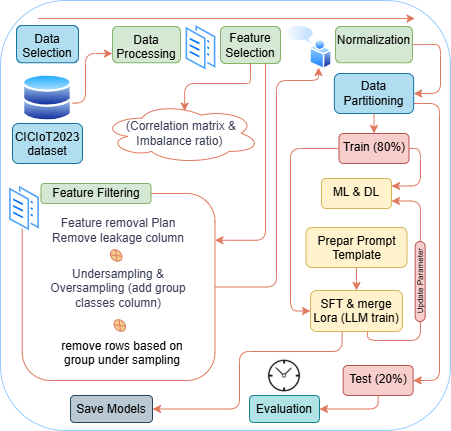

## Evaluating Artificial Intelligence models for IoT Network Intrusion Detection: An Analysis of Performance and Time Efficiency

COMP9340 – Computer Security Course

- Lecture: Prof. [Mohaiesn Daivad](https://www.cs.ucf.edu/~mohaisen/)
- Students: [Ruwa AbuHweidi](https://github.com/RuwaYafa) and [Monther Salahat](https://github.com/msalahat2015/IoT-IDS)

---
* Our Project has two evaluation parts: Deep Learning and Machine Learning code are available on this repository [Monther Salahat](https://github.com/msalahat2015/IoT-IDS), and LLM code [Ruwa AbuHweidi](https://github.com/RuwaYafa/IoT-IDS)
* All Results are uploaded in repository [Dropbox](https://www.dropbox.com/scl/fo/7y8a8j7tko3da90sr6mco/AHpHYC95o7b65hER_MAKjKs?rlkey=2m6asv519j7w6li4d2c45ecbo&dl=0):
  * Logs.
  * Saved models (Machine and Deep Learning).
  * Checkpoints for trained LLM models.
---
## ▶️ Reproducability

To reproduce our work you can follow the next steps after change the paths depends on your machine.
---
## ▶️ Data processing: the same for machine learning and Deep learning parts
### pre-process:
    export PYTHONPATH="${PYTHONPATH}:/rep/rabuhweidi/sft/SFTTraining-SemEval/src"
    export PYTHONPATH="${PYTHONPATH}:/rep/rabuhweidi/LLMTraining/src"
    python /rep/rabuhweidi/sft/SFTTraining-SemEval/src/blm/cli/process.py \
        --output_path /rep/rabuhweidi/sft/SFTTraining-SemEval/input_folder \
        --n 
---
## ▶️ Training
### SFT - The Training Process
    CUDA_LAUNCH_BLOCKING=1 PYTHONPATH="$PYTHONPATH:/rep/rabuhweidi/LLMTraining/src" deepspeed --num_gpus=2 /rep/rabuhweidi/LLMTraining/src/blm/cli/train.py \
        --model_name_or_path mistralai/Mistral-7B-Instruct-v0.2 \
        --quantize True \
        --token hf_**** \
        --data_path /rep/rabuhweidi/sft/SFTTraining-SemEval/input_folder \
        --max_seq_length 1024 \
        --num_train_epochs 1 \
        --per_device_train_batch_size 1 \
        --gradient_accumulation_steps 8 \
        --gradient_checkpointing True \
        --learning_rate 0.0002 \
        --weight_decay 0.0 \
        --bf16 True \
        --tf32 False \
        --output_dir /rep/rabuhweidi/sft/SFTTraining-SemEval/output_folder/CICIoT_2023/mistralai-CICIoT_2023 \
        --logging_strategy steps \
        --logging_steps 40 \
        --eval_strategy steps \
        --eval_accumulation_steps 200 \
        --save_steps 200 \
        --deepspeed /rep/rabuhweidi/sft/SFTTraining-SemEval/src/blm/config/deepspeed_zero3.json \
        --lora_r 64 \
        --lora_alpha 16 \
        --lora_dropout 0.1
---
## ▶️ Evaluation
### evaluation-baseline: 
    PYTHONPATH="${PYTHONPATH}:/rep/rabuhweidi/sft/SFTTraining-SemEval/src" python /rep/rabuhweidi/sft/SFTTraining-SemEval/src/blm/utils/eval.py \
        --model_path mistralai/Mistral-7B-Instruct-v0.2 \
        --test_data_path /rep/rabuhweidi/sft/SFTTraining-SemEval/input_folder/eval \
        --token hf_**** \        
        --tokenizer_name mistralai/Mistral-7B-Instruct-v0.2 \
        --output_predictions_path /rep/rabuhweidi/sft/SFTTraining-SemEval/output_folder/CICIoT_2023/test.csv \
        --test_sample_limit 2240 \
        #--temperature  0 \
        #--top_p 1 \
        #--top_k 1

---
## ▶️ Model 
### Marge Lora: 
    CUDA_LAUNCH_BLOCKING=1 PYTHONPATH="${PYTHONPATH}:/rep/rabuhweidi/LLMTraining/src" python "/rep/rabuhweidi/LLMTraining/src/blm/cli/merge_lora.py" \
        --lora_path "/rep/rabuhweidi/sft/SFTTraining-SemEval/output_folder/CICIoT_2023/mistralai-CICIoT_2023/checkpoint-1200" \
        --merged_path "/rep/rabuhweidi/sft/SFTTraining-SemEval/model/try7_Mistral-7B-Instruct-v0.2-CICIoT_2023" \
        --hf_token "hf_****"

---
## ▶️ Cont. Evaluation
### evaluation-after SFT: 
    PYTHONPATH="${PYTHONPATH}:/rep/rabuhweidi/sft/SFTTraining-SemEval/src" python /rep/rabuhweidi/sft/SFTTraining-SemEval/src/blm/utils/eval.py \
        --model_path /rep/rabuhweidi/sft/SFTTraining-SemEval/model/try7_Mistral-7B-Instruct-v0.2-CICIoT_2023 \
        --test_data_path /rep/rabuhweidi/sft/SFTTraining-SemEval/input_folder/eval \
        --hf_token hf_**** \
        --tokenizer_name /rep/rabuhweidi/sft/SFTTraining-SemEval/model/try7_Mistral-7B-Instruct-v0.2-CICIoT_2023 \
        --output_predictions_path /rep/rabuhweidi/sft/SFTTraining-SemEval/output_folder/CICIoT_2023/predict_log_Mistral_CICoT_SFT \
        --test_sample_limit 2240 \
        #--temperature  0 \
        #--top_p 1 \
        #--top_k 1
---
## ▶️ Deploy
### save on huggingface:
    CUDA_LAUNCH_BLOCKING=1 PYTHONPATH="${PYTHONPATH}:/rep/rabuhweidi/sft/SFTTraining-SemEval/src" python /rep/rabuhweidi/sft/SFTTraining-SemEval/src/blm/utils/save_to_hfhub.py \
        --model_path "/rep/rabuhweidi/sft/SFTTraining-SemEval/output_folder/CICIoT_2023/model_try7_Mistral-7B-Instruct-v0.2-CICIoT_2023/mistralai" \
        --repo_name "RuwaYafa/Mistral-7B-Instruct-v0.2-CICIoT_2023" \
        --hf_token "hf_****" \
        --your_name "Tarqeem" \
        #--private  # Remove this for public repo
---
### Our Related Links:
    Mistral-7B SFT model:
    https://huggingface.co/RuwaYafa/Mistral-7B-Instruct-v0.2-CICIoT_2023
    RuwaYafa/Mistral-7B-Instruct-v0.2-CICIoT_2023
    
    Llama-1B SFT model:
    https://huggingface.co/RuwaYafa/Llama-3.2-1B-Instruct-CICIoT_2023
    RuwaYafa/Llama-3.2-1B-Instruct-CICIoT_2023
    
    Llama-3B SFT model:
    https://huggingface.co/RuwaYafa/Llama-3.2-3B-Instruct-CICIoT_2023
    RuwaYafa/Llama-3.2-3B-Instruct-CICIoT_2023
    
    Dataset:
    https://huggingface.co/datasets/Tarqeem/ICICoT-2023
    Tarqeem/ICICoT-2023
---

### ▶️ Used Prompt:
    System prompt:
    You are a strict traffic-classification model.
    
    Rules:
    • You will receive structured network traffic features.
    • Select one numeric ID that matches the traffic type:
        0 = DDoS
        1 = DoS
        2 = Benign
        3 = Unknown
    • Return ONLY the number.
---
    User prompt:
    Classify the traffic based on the features below.
    
    Features: {sentence}
    
    LabelID:
---
#### Acknowledgement
This project thanks the open repository of [mohammedkhalilia](https://github.com/mohammedkhalilia/LLMTraining/tree/main), which provides a starting point for developing our code.
